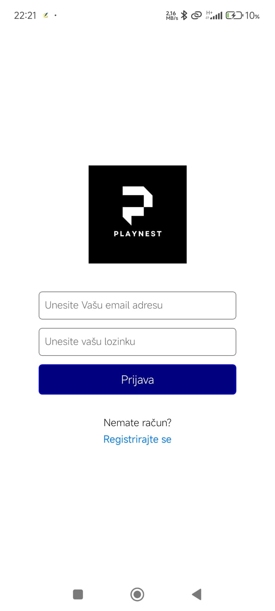
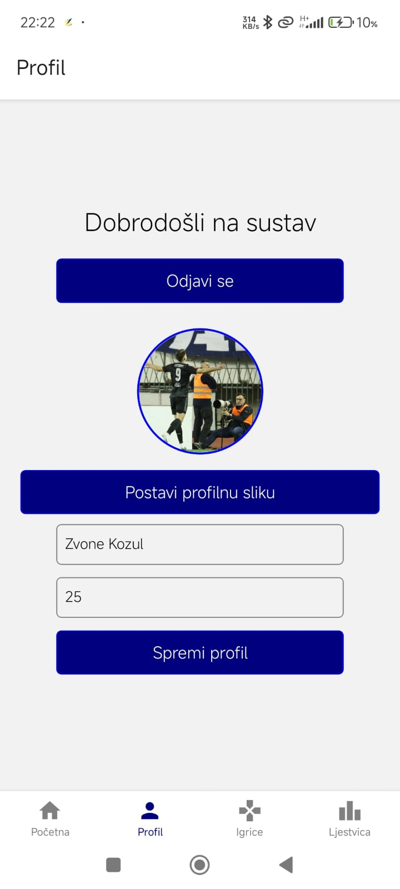
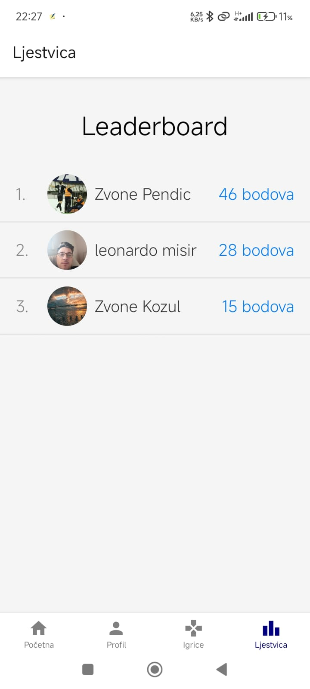
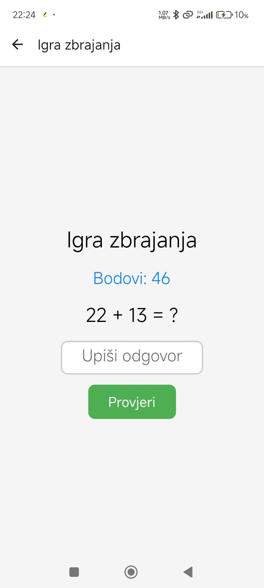
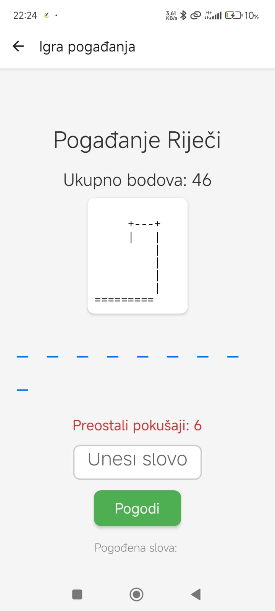
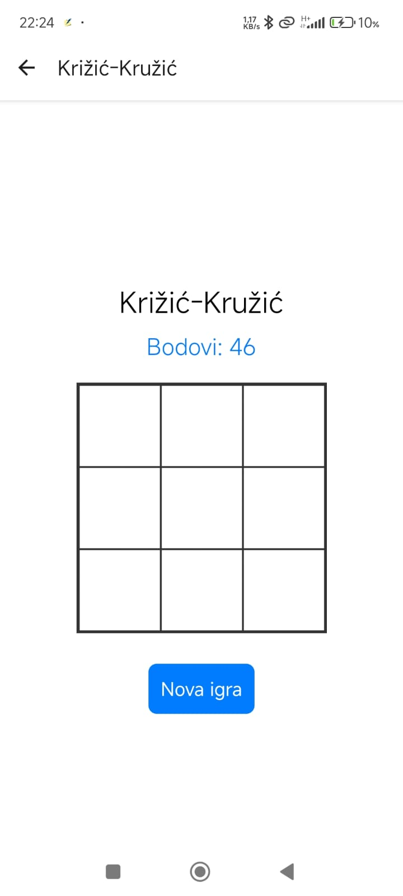

# PlayNest 🎮

This is a mobile application project developed as part of the university course **"Mobile Application Development"**.

## 🛠️ Technologies Used

- **React Native** with **Expo** – for building the mobile application.
- **Supabase** – as the backend solution (authentication, database, and storage).

## 📱 App Features

- ✅ **User Authentication**  
  Users can register and log in using their email and password.

- 🎮 **Three Mini Games**  
  The app includes three interactive games:
  - **Tic Tac Toe**
  - **Hangman**
  - **Math Quiz**

- 🏆 **Leaderboard**  
  A leaderboard system tracks and displays the points scored by all registered users.

- 🖼️ **User Profiles**  
  Users can upload a **profile picture** and view/update their personal information.

## 📸 Screenshots

| Login View | Profile | Leaderboard |
|------------|---------|-------------|
|  |  |  |

| Math Quiz | Hangman | Tic Tac Toe |
|-----------|---------|-------------|
|  |  |  |

## 🚀 Getting Started

To run the app locally:

```bash
git clone https://github.com/ZvoneK99/PlayNest.git
cd playnest
npm install
npx expo start
